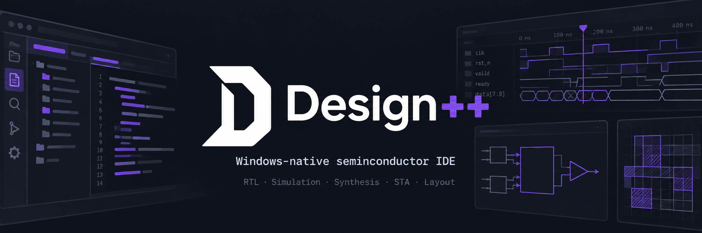
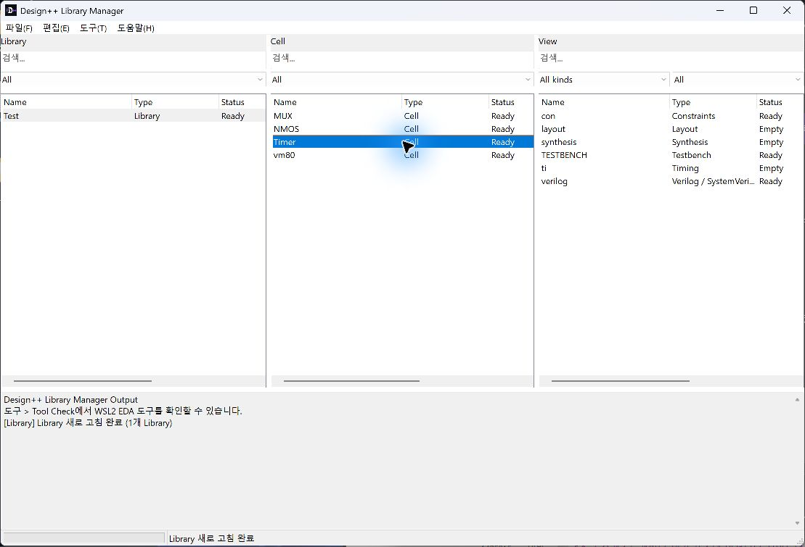
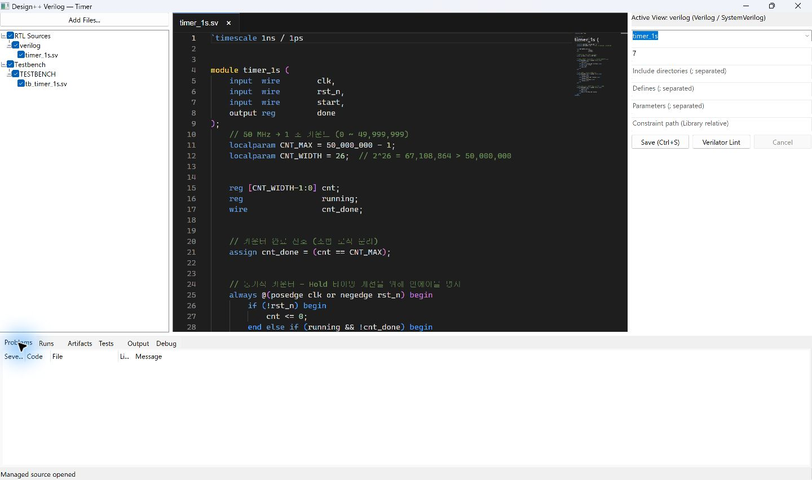
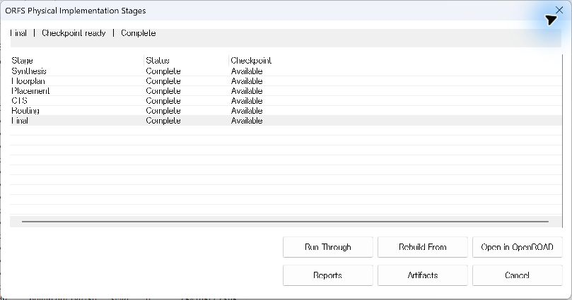
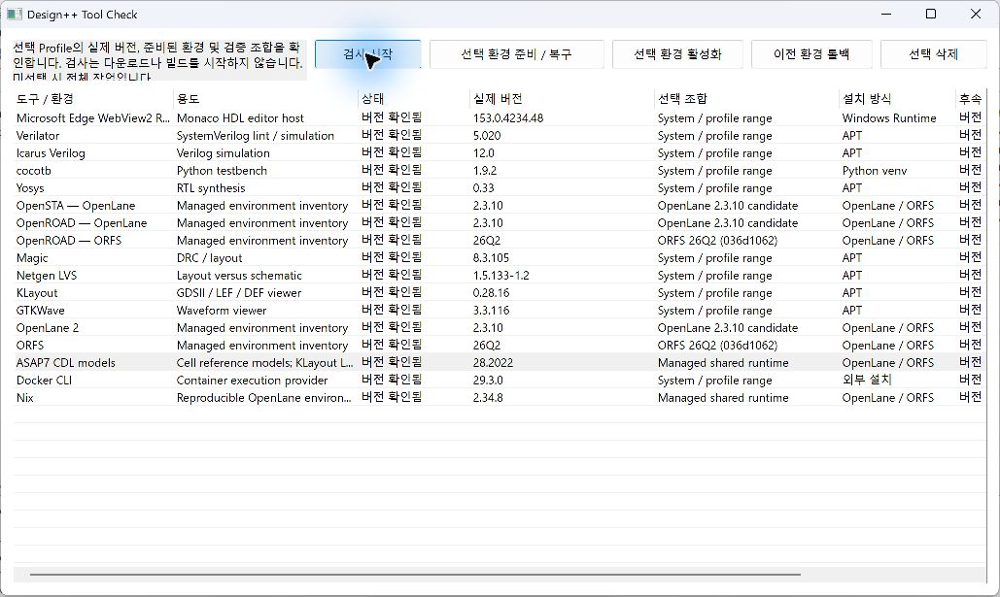

# Design++



> **Semiconductor IDE (Integrated Design Environment)**

[](https://isocpp.org/)


**English** | [한국어](README_ko.md)

**Design++** is an integrated design environment for semiconductor design on
Windows. It brings HDL editing, simulation, logic synthesis, timing analysis,
physical implementation, and verification into a Library / Cell / View workspace.

The current implementation focuses on digital RTL-to-layout design. Designers
can organize source files and constraints, select a PDK and toolchain, run design
stages, and inspect their results within the same environment. The desktop UI
runs natively on Windows; Linux EDA tools execute through WSL2.

## Why this project?

Semiconductor design involves multiple representations of the same circuit:
RTL, testbenches, synthesized netlists, timing constraints, and physical layout.
Each stage also has its own tools, configuration, logs, and generated files.

Design++ aims to keep these parts connected around the design itself:

- Organize reusable designs through Libraries, Cells, and Views.
- Move from source editing to simulation, synthesis, and physical implementation.
- Keep toolchain and PDK configuration alongside the design workflow.
- Inspect diagnostics, reports, and previous runs without losing the source context.

## Key Features

### Library Manager and Design Workspaces

The Library Manager organizes projects as **Library → Cell → View**. A Cell groups
the source and settings for a design, while Views expose RTL, testbench,
constraints, synthesis, timing, and layout work. Independent workspaces support
working with multiple Cells, and the central Output collects task-labelled logs.



### HDL Editing and Simulation

The embedded **Monaco Editor** provides Verilog/SystemVerilog editing and diagnostic
navigation. Source management includes top-module selection, include directories,
defines, and parameters. Verilator lint, Icarus/Verilator simulation, cocotb
execution, and GTKWave integration support design and testbench verification.



### Synthesis and Timing Analysis

**Yosys** synthesis maps RTL to a selected cell library and produces netlists and
reports. **OpenSTA** performs timing analysis using compatible synthesis results,
Liberty libraries, and timing constraints. Run records retain generated artifacts
and raw tool output for later inspection.

### Physical Design and Verification

**OpenLane 2** and **OpenROAD Flow Scripts (ORFS)** provide physical implementation
flows. ORFS also supports stage selection and resuming compatible checkpoints.
Layout workspaces present run history, metrics, generated artifacts, and
verification results, with external viewer integration.



PDK selection is saved per Cell. Independent DRC/LVS availability depends on the
backend and registered recipe: ORFS sky130hd has DRC/LVS recipes, while ASAP7 has
DRC support only. OpenLane verification results are collected from its flow reports.

### Toolchain Management

**Tool Check** handles environment preparation, probing, activation, and rollback.
**Toolchain Doctor** manages distribution and custom path settings. Compatibility
checks validate framework revisions and required tool capabilities before execution.



The image shows versions detected on a local example computer. This release
supports OpenLane 2 2.3.10 and ORFS 26Q2 through the managed toolchains in
Tool Check; execution also requires a matching revision and tool capabilities.

Long-running work executes outside the UI thread with progress, cancellation,
and CPU resource coordination. Atomic persistence and writer leases protect
project data when multiple windows or processes access it.

## Design Workflow

```text
Library / Cell / View
        │
        ▼
RTL + Testbench + Constraints
        │
        ├── Lint / Simulation → Diagnostics / Waveforms
        │
        ▼
Synthesis → Netlist → Timing Analysis
        │
        ▼
Physical Implementation → Layout / GDS
        │
        ▼
Supported DRC / LVS → Reports / Run History
```

A typical session starts by preparing a toolchain in Tool Check, creating a Cell,
and adding RTL and testbench files. After simulation and synthesis, select the
physical backend, PDK, and constraints for layout generation. Inspect each stage's
results before proceeding; supported checks vary with the selected environment.

## Technology Stack

| Area | Implementation |
|---|---|
| Language | C++20 |
| Desktop UI | Native Win32, per-monitor DPI support |
| Source editor | Monaco hosted in Microsoft WebView2 |
| Build | Visual Studio / MSBuild |
| Linux execution | WSL2, structured process requests |
| Simulation | Verilator, Icarus Verilog, cocotb, GTKWave |
| Synthesis / STA | Yosys, OpenSTA |
| Physical implementation | OpenLane 2, OpenROAD Flow Scripts |
| Physical verification | Backend-specific KLayout / Magic / Netgen integration |

## Requirements and Getting Started

Design++ runs on Windows 10/11 x64. Its WSL2 setup requires Windows 10 version
2004 (build 19041) or later, or Windows 11. Storage figures refer to free space
for the app, WSL2, EDA toolchains, and design data.

| | CPU | Memory | Free storage |
|---|---|---|---|
| Minimum | Intel Core i5-3470 (Windows 10 reference CPU), or an equivalent x64 CPU with SLAT and hardware virtualization enabled | 4 GB or more | 50 GB or more |
| Recommended | Intel Core i7 10th generation or newer | 32 GB or more | 50 GB or more |

The 4 GB minimum follows Microsoft's Windows hypervisor host guidance; it is
only a baseline for starting WSL2, not a promise that an EDA flow will fit in
memory. See Microsoft's [WSL installation requirements](https://learn.microsoft.com/en-us/windows/wsl/install)
and [virtualization hardware requirements](https://learn.microsoft.com/en-us/windows-server/virtualization/hyper-v/host-hardware-requirements?pivots=windows-server).
Intel [lists VT-x and EPT for the i5-3470](https://www.intel.com/content/www/us/en/products/sku/68316/intel-core-i53470-processor-6m-cache-up-to-3-60-ghz/specifications.html),
which establishes it as a concrete WSL2-capable CPU reference; this does not
establish EDA-flow performance. Windows 11 additionally requires a CPU on
[Microsoft's supported list](https://support.microsoft.com/en-us/windows/experience/compatibility/windows-11-system-requirements).

- WebView2 Runtime for the embedded editor (the NSIS setup installs it when missing);
  the Release app includes its C++ runtime
- WSL2 with a Linux distribution for EDA execution
- The toolchain, libraries, and PDK required by the selected design flow

See the [installation guide](docs/INSTALL.md) for setup and recovery, and
[Library Manager](docs/LIBRARY_MANAGER.md) / [Workspace](docs/WORKSPACE.md) for
usage. The managed toolchains are OpenLane 2 2.3.10 and ORFS 26Q2. PDK and
independent DRC/LVS support depend on the selected backend and recipe.

## Build

Use Visual Studio with the C++ desktop workload and Windows SDK. Node.js/npm is
required to bundle the editor assets. From a Developer PowerShell:

```powershell
msbuild Design++.slnx /m /p:Configuration=Debug /p:Platform=x64
msbuild Design++.slnx /m /p:Configuration=Release /p:Platform=x64
```

The Release application is generated at `x64/Release/Design++.exe`.

## Project Structure

```text
src/ and include/designpp/
  app/           Application startup and composition
  gui/           Native windows, editor hosting, and presentation
  application/   Design workflows, persistence, and run management
  core/          Tool-neutral project, flow, and artifact models
  runtime/       Processes, WSL, scheduling, and cancellation
  adapters/      Tool-specific commands and result parsing
editor/          Bundled Monaco integration
tests/          Unit, contract, GUI, and WSL integration tests
tools/          Build and distribution scripts
docs/           User guides, formats, architecture, and development history
```

## Documentation

- [Step-by-step user guide (한국어)](docs/guide/README.md)

- [Documentation index](docs/README.md)
- [Architecture](docs/ARCHITECTURE.md) · [Development plan](docs/PROJECT_PLAN.md)
- [Project format](docs/PROJECT_FORMAT.md) · [Library format](docs/LIBRARY_FORMAT.md)
- [Third-party notices](THIRD_PARTY_NOTICES.md)

## License

Design++ is licensed under the [MIT License](LICENSE). Bundled third-party
components retain their own licenses; see [Third-party notices](THIRD_PARTY_NOTICES.md).
