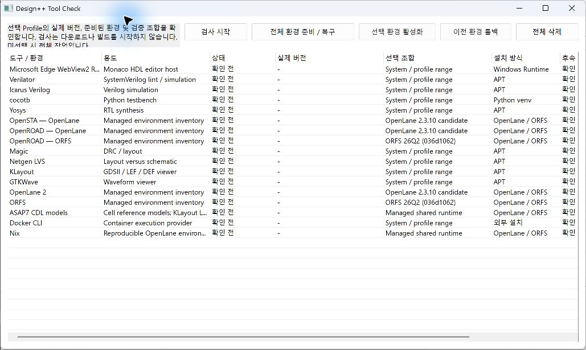
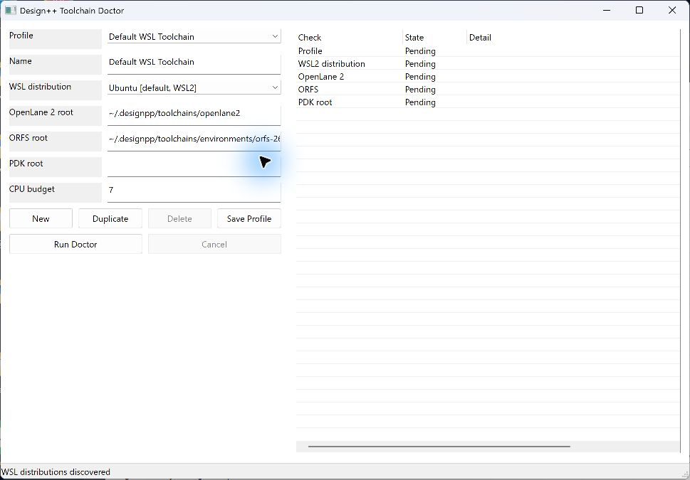

# 01. 환경 준비

[사용 설명서 목차](README.md) · [다음 단계](02-project.md)

## 목표와 준비물

Windows 앱에서 사용할 WSL 배포판, EDA 도구와 실행 환경을 확인합니다.
앱 설치와 WebView2 Runtime 준비는 [설치 안내](../INSTALL.md)를 먼저 따릅니다.
도구 다운로드에는 인터넷과 디스크 공간이 필요하며 WSL 초기 설정에는
관리자 승인 또는 Windows 재시작이 필요할 수 있습니다.

## 실행 순서

1. Library Manager의 **도구 > Tool Check**를 엽니다.
   
2. WSL2와 사용할 Linux 배포판을 확인합니다. 준비되지 않았다면 WSL 설정을 진행합니다.
   새 설치는 Ubuntu를 초기화하고 `designpp` 사용자를 만든 뒤 기본 배포판으로
   지정합니다. 기존 Ubuntu 사용자는 바꾸지 않습니다.
3. 수행할 작업에 필요한 도구를 설치하고 재검사합니다. 모든 도구를 설치해야
   RTL 편집이나 개별 단계를 시작할 수 있는 것은 아닙니다.
4. OpenLane 2 또는 ORFS를 사용할 경우 해당 환경을 준비합니다.
   설치와 활성화는 별도 동작입니다. 검사가 통과한 환경을 선택해 활성화합니다.
5. 기존 도구를 사용할 경우 Toolchain Doctor에서 배포판과 경로를 확인합니다.
   
6. 설정을 변경했다면 기존 작업 창을 닫았다가 다시 열어 새 설정으로 시작합니다.

Tool Check의 설치 완료와 Doctor의 `Pass`는 별개입니다. Doctor는 선택한
Profile의 WSL 배포판에서 지정된 경로를 검사합니다. 새 Profile의 기본 경로는
`~/.designpp/toolchains/environments/openlane2-2.3.10`과
`~/.designpp/toolchains/environments/orfs-26Q2`입니다. 기존 기본 Profile에
저장된 옛 기본 경로도 열 때 메모리에서 새 경로로 맞춥니다. 경로 입력란은
계속 편집 가능하며, 직접 지정한 다른 경로와 사용자 Profile은 유지됩니다.
Tool Check에서 준비된 환경을 활성화하거나 Doctor의 root 경로를 수정한 뒤
저장하세요. 기본 Profile의 OpenLane PDK root는 `~/.volare`로 자동 입력됩니다.
다른 설치 경로를 쓰면 직접 수정해 저장할 수 있습니다. Doctor의 PDK 행은
OpenLane PDK 또는 설치된 ORFS의 실행 가능한 platform을 확인합니다. ORFS
platform이 있으면 OpenLane PDK root가 없어도 통과하며 확인한 출처를 표시합니다.
개별 PDK의 DRC/LVS 지원은 PDK 관리 창에서 확인합니다.

설치 실패 후 디스크 공간을 회수하려면 Tool Check의 **빌드 캐시 정리**를
누릅니다. 제거 대상은 Design++가 남긴 OpenLane 2·ORFS 후보 checkout입니다.
다른 설치가 진행 중이면 정리를 중단하며, 완료된 환경과 공유 Nix 저장소는
유지합니다.

| 작업 | 확인할 도구 |
|---|---|
| Lint | Verilator |
| HDL 시뮬레이션 | 선택한 Icarus Verilog 또는 Verilator |
| Python 테스트벤치 | cocotb 환경과 선택한 simulator |
| 파형 보기 | GTKWave |
| 합성 / 타이밍 | Yosys / OpenSTA |
| Layout | 선택한 OpenLane 2 또는 ORFS 환경 |
| 물리 검증 | 해당 recipe가 요구하는 KLayout, Magic, Netgen 등 |

## 정상 결과

설치 로그의 종료 코드와 재검사 결과를 함께 확인합니다. Layout 실행 시에는
추가로 framework revision과 필수 기능을 probe합니다. Tool Check에서 도구를
찾았다는 사실만으로 특정 PDK의 DRC/LVS까지 지원되는 것은 아닙니다.

## 막혔을 때

- 설치 로그는 별도 Tool Check 창이 아니라 **Library Manager Output**에서 확인합니다.
- 새 PC에서 재부팅 필요 알림이 나오면 **지금 재부팅**을 선택하거나 직접
  재부팅한 뒤 **WSL2 자동 설정**을 다시 실행합니다. 중단된 새 Ubuntu 초기화는
  pending 표식으로 이어집니다. `4294967295`와 한 글자 출력만 남는
  이전 1.0.0 설치본은 새 설치 프로그램으로 업데이트합니다.
- `capability_probe` 실패: 경로, 배포판, 원본 오류와 종료 코드를 확인합니다.
- 현재 managed 위치는 `~/.designpp/toolchains/environments/orfs-26Q2`와
  `~/.designpp/toolchains/environments/openlane2-2.3.10`입니다. 기존 설정이
  존재하지 않는 이전 경로를 가리키면 실제 설치 위치를 지정합니다.
- fingerprint 불일치: 환경을 재검사합니다. 임의로 값을 지우거나 검사를 우회하지 않습니다.
- 기존 설치가 있다는 메시지가 나왔다면 재설치보다 재검사·활성화 여부를 먼저 확인합니다.

[사용 설명서 목차](README.md) · [다음 단계](02-project.md)
