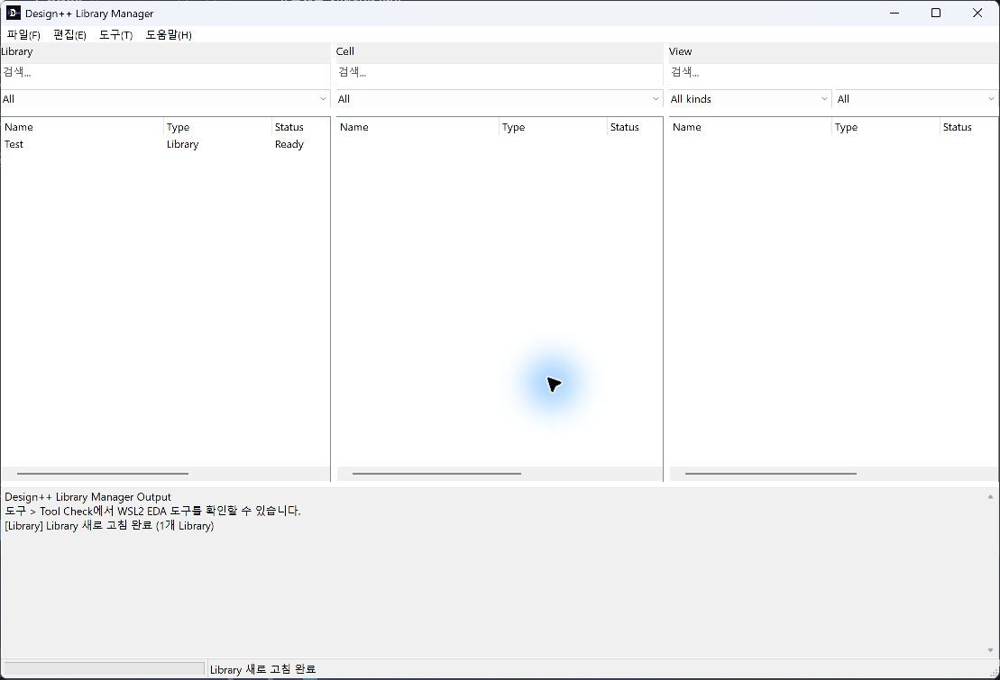
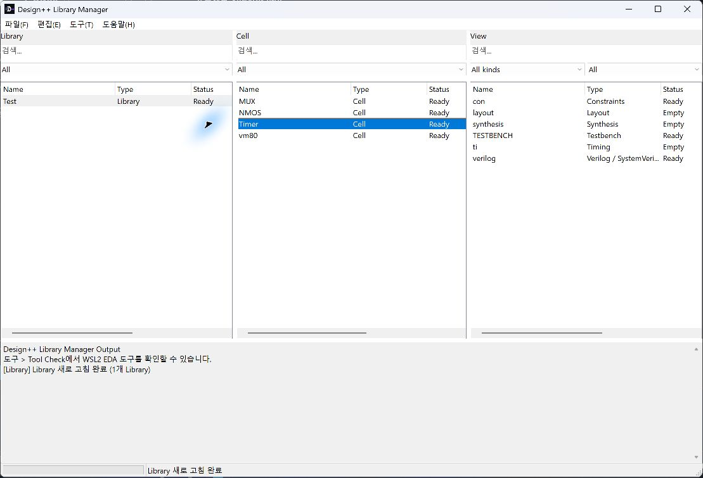

# 02. Library · Cell · View 구성

[사용 설명서 목차](README.md) · [이전 단계](01-environment.md) · [다음 단계](03-rtl-lint.md)

## 목표와 준비물

작업할 회로를 Library와 Cell로 구성하고 입력 파일을 관리합니다.
Library는 설계 묶음, Cell은 설계 단위, View는 작업 종류입니다.

## 실행 순서

1. Library Manager에서 사용할 Library Root를 설정합니다.
   
2. **새 Library...**로 Library를 만들고 선택합니다.
3. 해당 Library에 Cell을 만듭니다. 예를 들어 카운터 설계는 `Counter`로 구분할 수 있습니다.
4. 목적에 맞게 RTL, Testbench, Constraints, Synthesis, Timing, Layout View를 만듭니다.
5. View를 더블클릭하여 작업 창을 엽니다.
   
6. 소스 작업 창의 **Add Files...**로 파일을 추가합니다.
   파일은 Library 내부 관리 폴더에 복사되므로 이후 편집 대상은 그 복사본입니다.
7. Source 패널에서 RTL, Testbench, Constraints 분류와 포함할 파일을 확인합니다.

## 저장과 작업 단위

같은 Cell의 소스와 설정은 후속 작업의 입력입니다. 다른 Cell의 결과를 선택해
연결하는 방식으로 입력 불일치를 우회하지 않습니다. 편집한 내용은 **Save (Ctrl+S)**로
저장하고, 실행 전에 표시되는 저장 요청을 처리합니다.

프로젝트가 read-only이면 쓰기 소유권, 다른 창/프로세스, 저장 형식 오류를 확인합니다.
미저장 편집이 있는 상태에서 외부 변경을 불러오면 자신의 변경이 사라질 수 있으므로
충돌 안내를 읽고 Reload/Overwrite/Cancel을 선택합니다.

## 다음 단계로 넘어가기 전

- 대상 Library와 Cell 이름이 맞는지 확인합니다.
- 실제 설계 RTL과 테스트벤치가 올바른 View에 들어 있는지 확인합니다.
- 테스트벤치의 top과 DUT의 top을 구분합니다.
- 저장이 성공했는지 확인합니다.

저장 형식의 세부 구조는 [Library 형식](../LIBRARY_FORMAT.md)과
[프로젝트 형식](../PROJECT_FORMAT.md)에 있습니다. 실행에 필요한 설정은 UI에서
수정하고 manifest를 직접 편집하는 방법은 일반 사용 절차로 권장하지 않습니다.

[사용 설명서 목차](README.md) · [이전 단계](01-environment.md) · [다음 단계](03-rtl-lint.md)
