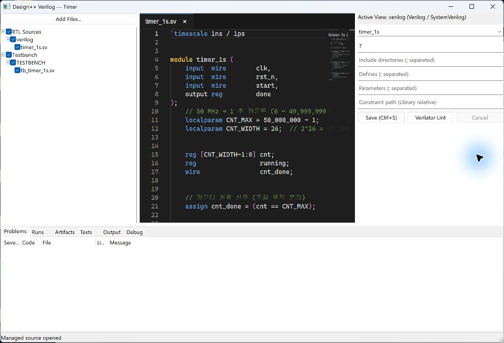

# 03. RTL 편집과 Lint

[사용 설명서 목차](README.md) · [이전 단계](02-project.md) · [다음 단계](04-simulation.md)

## 목표와 준비물

Verilog/SystemVerilog 소스를 편집하고 합성이나 시뮬레이션 전에 정적 진단을 확인합니다.
RTL 파일과 사용할 top module, Verilator가 필요합니다.

## 실행 순서

1. RTL View를 열고 Source 패널에서 편집할 파일을 더블클릭합니다.
2. Inspector에서 **Top module**, include 경로, defines와 parameters를 확인합니다.
   자동으로 제안된 값도 실제 설계 의도와 일치하는지 확인합니다.
   
3. Source 패널의 체크박스로 실행에 포함할 RTL 파일을 선택합니다.
4. **Save (Ctrl+S)**로 변경 사항을 저장합니다.
5. **Verilator Lint**를 실행합니다. 미저장 항목 안내가 나오면 저장을 완료합니다.
6. **Problems**에서 오류와 경고를 확인합니다. 항목을 더블클릭하면 소스 위치로 이동합니다.
7. 수정·저장·재실행을 반복합니다. 중단하려면 **Cancel**을 누릅니다.

## 결과 읽기

Lint는 소스의 정적 문제를 찾는 단계입니다. Lint 성공은 기능 시뮬레이션 통과나
타이밍 만족을 의미하지 않습니다. 경고도 의도된 동작인지 검토합니다.
Runs에는 실행 기록, Output에는 원본 도구 출력이 남습니다.

## 자주 발생하는 문제

| 증상 | 확인할 항목 |
|---|---|
| top module을 찾을 수 없음 | 선언 이름과 Top module, 파일 포함 여부 |
| include 파일을 찾을 수 없음 | 관리 폴더에 파일이 있는지와 include 경로 |
| 정의되지 않은 module | 하위 module 소스 누락, 조건부 define |
| 편집한 내용이 반영되지 않음 | 실행 전 저장 여부와 선택한 Cell |
| 편집기가 표시되지 않음 | WebView2 Runtime 및 초기화 오류 |

Lint에는 저장된 입력을 사용합니다. 실행 중 입력을 바꿨다면 결과가 어느 저장 상태에
대한 것인지 확인하고 필요한 단계를 다시 실행합니다.

[사용 설명서 목차](README.md) · [이전 단계](02-project.md) · [다음 단계](04-simulation.md)
