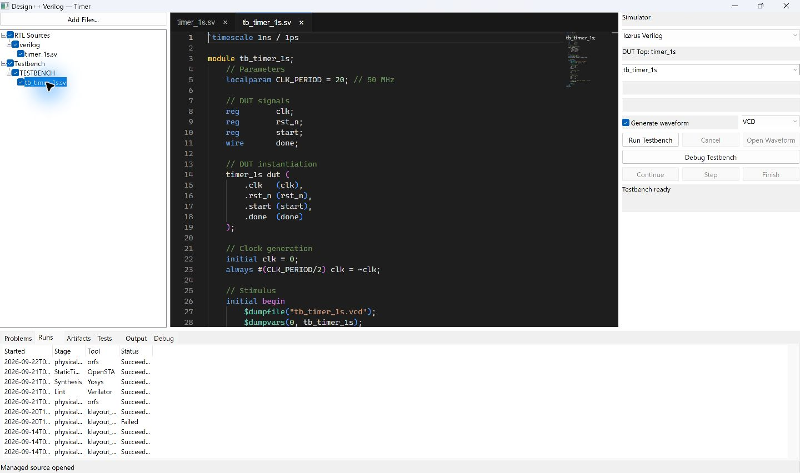

# 04. 시뮬레이션과 테스트벤치

[사용 설명서 목차](README.md) · [이전 단계](03-rtl-lint.md) · [다음 단계](05-synthesis.md)

## 목표와 준비물

테스트벤치로 DUT의 동작을 확인하고 필요한 경우 파형을 생성합니다.
설계 RTL, 테스트벤치, simulator가 필요하며 cocotb에는 Python 환경도 필요합니다.

## HDL 테스트벤치 실행

1. 같은 Cell에 DUT RTL과 Testbench View의 파일을 준비합니다.
2. Testbench 소속 파일을 활성 탭으로 엽니다. Inspector가 실행 패널로 전환됩니다.
3. **Simulator**를 선택하고 DUT 설정과 **Testbench Top**을 확인합니다.
   Testbench Top은 테스트를 수행하는 module이며 DUT module과 다를 수 있습니다.
4. 파형이 필요하면 **Generate VCD / Generate waveform**을 켭니다.
   표시되는 형식 선택은 backend 지원 범위를 따릅니다.
   
5. 변경 사항을 저장한 뒤 **Run Testbench**를 누릅니다.
6. **Tests**, **Runs**, **Artifacts**, **Output**에서 실행 결과를 확인합니다.
7. 유효한 파형이 생성되면 **Open Waveform**으로 GTKWave를 엽니다.

## cocotb 실행

1. Simulator에서 cocotb 실행 경로를 선택합니다.
2. DUT Top을 확인하고 Python 테스트 module을 설정합니다.
   module 이름은 Python에서 import할 이름이며 일반적으로 `.py` 확장자를 제외합니다.
3. 필요한 경우 testcase filter를 지정합니다. 비워 두면 기본 테스트 선택을 사용합니다.
4. 저장 후 실행하고 Tests의 개별 테스트 결과와 Python 예외를 확인합니다.

## 테스트벤치 디버깅

Icarus/VVP 경로의 **Debug Testbench**는 일반 실행과 별도입니다.
**Continue**, **Step**, **Finish**, **Stop**과 Debug 탭을 사용합니다.
Step은 scheduler event 단위이며 소스 한 줄 단위 실행으로 해석하지 않습니다.
임의 셸 접속용 백틱 기능과는 다른 기능입니다.

## 결과와 실패 구분

- 컴파일 실패: module, 문법, 파일 포함, simulator 지원 기능을 확인합니다.
- 테스트 실패: assertion과 기대값, clock/reset 순서 및 시간 단위를 확인합니다.
- 종료되지 않음: 테스트 종료 조건과 `$finish`, 무한 대기 여부를 확인합니다.
- 파형 없음: 생성 옵션, 실제 실행 여부, 유효한 artifact가 남았는지 확인합니다.
- 취소된 실행의 파형은 partial일 수 있습니다. 전체 테스트 성공 결과로 사용하지 않습니다.

**Cancel** 후 종료 상태가 확정될 때까지 기다립니다. 소스 수정 후 이전 파형을
새 실행의 결과로 혼동하지 않도록 Run과 시작 시각을 확인합니다.

[사용 설명서 목차](README.md) · [이전 단계](03-rtl-lint.md) · [다음 단계](05-synthesis.md)
