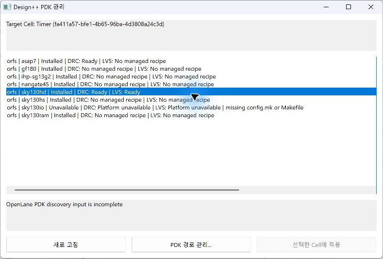
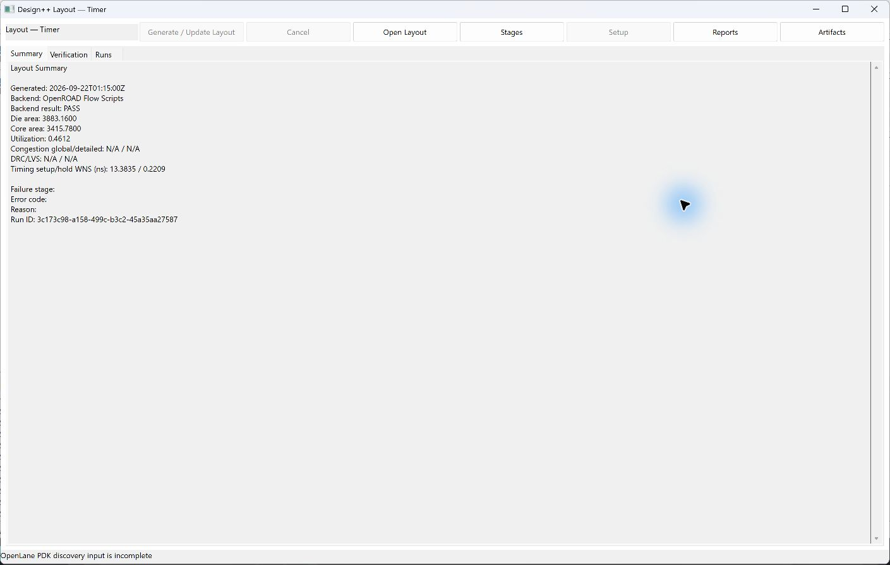
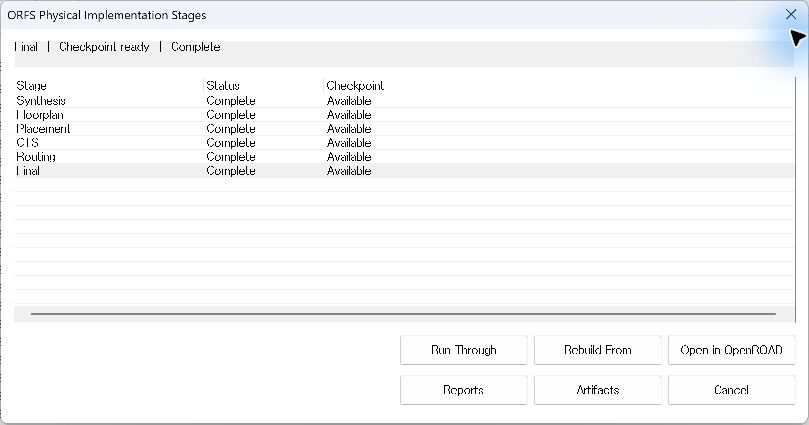

# 07. PDK 선택과 Layout 실행

[사용 설명서 목차](README.md) · [이전 단계](06-timing.md) · [다음 단계](08-verification.md)

## 목표와 준비물

OpenLane 2 또는 ORFS로 물리 설계를 수행합니다. 저장된 RTL, top module,
호환되는 framework 환경, 설치된 PDK/표준 셀 라이브러리와 제약이 필요합니다.

## PDK와 설정 준비

1. 대상 Cell의 **Layout** View를 엽니다.
2. PDK 관리 창에서 대상 Cell을 확인하고 backend와 설치된 PDK 항목을 확인합니다.
   저장/적용 후 같은 Cell의 Layout에서 선택이 반영됐는지 확인합니다.

   

3. Layout의 **Setup**에서 **Backend**, **PDK**, 표준 셀 라이브러리 선택을 확인합니다.
   Setup이 비활성이고 PDK 검색 입력 부족이 표시되면 **PDK 경로 관리**와
   **Tool Check**에서 경로를 확인한 뒤 다시 엽니다.
4. clock port와 period를 설정합니다. clock port가 여러 개면 표시된 안내에 따라
   세미콜론으로 구분합니다. PnR/Signoff SDC를 쓰는 경우 해당 제약도 확인합니다.
5. Core utilization, Placement density, Die/Core area 등 필요한 항목만 조정합니다.
   비어 있는 선택 항목은 기본값을 상속하며 0을 입력한 것과 같지 않습니다.
6. **Save**로 해당 Cell에 저장합니다. 고급 JSON 설정은 backend에서 허용하는 값만 사용합니다.

## 전체 실행

1. **Generate / Update Layout**을 누릅니다.
2. probe → 입력 준비 → 도구 실행 순서의 상태와 Library Manager Output을 확인합니다.
3. **Summary**에서 상태와 메트릭, **Runs**에서 실행 기록을 확인합니다.

   

4. **Reports / Artifacts**에서 원본 보고서와 생성물을 확인합니다.
5. 호환되는 결과가 있으면 **Open Layout**으로 viewer를 엽니다.
   파일 생성 성공과 실제 viewer 실행 가능 여부는 별도입니다.

## ORFS 단계별 실행

**Stages**에서 대상 단계를 선택합니다.

| 단계 | 주요 역할 |
|---|---|
| Synthesis | RTL 합성과 매핑 |
| Floorplan | die/core와 초기 배치 조건, 전원망 등 준비 |
| Placement | 셀 배치 |
| CTS | clock tree 구성 |
| Routing | 배선 |
| Finish | 최종 결과 생성 |

- **Run Through**: 선택 단계까지 실행합니다.
- **Rebuild From**: 선택 단계부터 다시 수행할 실행을 요청합니다.
- **Open in OpenROAD**: 사용 가능한 단계 결과를 OpenROAD에서 확인합니다.

checkpoint는 source Run, 입력과 환경이 호환될 때만 재사용합니다. 환경이나
제약을 바꾼 뒤 이전 결과를 강제로 연결하지 않습니다.

## 실패 시 확인 순서

1. Summary의 Failure stage와 Reason, 중앙 Output의 첫 오류를 확인합니다.
2. `capability_probe`면 설치 경로·활성 환경·revision·필수 도구 기능을 확인합니다.
3. 입력 준비 실패면 top, 소스, 제약, 저장 경로를 확인합니다.
4. floorplan/PDN 실패면 core 크기와 PDK의 grid·전원망 요구를 확인합니다.
   작은 테스트 회로라도 PDK가 요구하는 최소 물리 크기는 필요합니다.
5. 배치·배선·타이밍 실패면 해당 단계 보고서와 제약을 확인합니다.

기존 결과가 있어도 새 실행 실패가 성공으로 바뀌지는 않습니다. 새 Run과 이전
Run을 구분하고, PDK 인식 성공과 Layout 전체 성공도 구분합니다.

[사용 설명서 목차](README.md) · [이전 단계](06-timing.md) · [다음 단계](08-verification.md)
