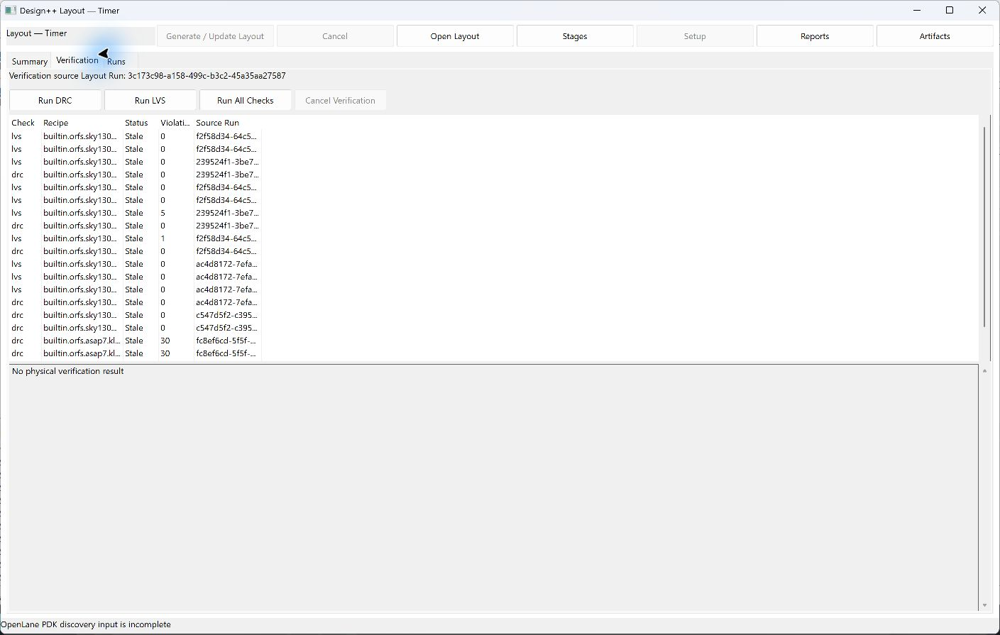

# 08. DRC · LVS 물리 검증

[사용 설명서 목차](README.md) · [이전 단계](07-layout.md) · [다음 단계](09-runs-recovery.md)

## 목표와 준비물

Layout 결과의 물리 규칙과 연결성을 검사합니다. 검증 source Layout Run과
호환되는 recipe, 규칙·모델 및 netlist 입력이 필요합니다.

## 지원 범위

| 환경 | 사용 방식 |
|---|---|
| ORFS sky130hd | 등록된 독립 DRC/LVS recipe |
| ORFS ASAP7 | 등록된 독립 DRC. LVS는 비활성 |
| ORFS nangate45 및 기타 | 설치·flow 실행 가능과 독립 검증 지원을 구분 |
| OpenLane 2 | flow가 수집한 DRC/LVS 보고서 확인 |

OpenLane Layout에서 독립 실행 버튼이 비활성이라고 해서 flow의 검증 결과도
없다는 뜻은 아닙니다. 지원되지 않는 PDK에 다른 PDK 규칙을 연결하지 않습니다.

## 실행 순서

1. 대상 Cell의 Layout을 열고 **Runs**에서 검증할 결과를 확인합니다.
2. **Verification** 탭의 **Verification source Layout Run**이 의도한 Run인지 확인합니다.

   

   화면의 `Stale` 표시는 이전 검증 기록이 현재 source Run과 연결되지 않는다는 뜻입니다.
   이전 기록을 현재 Run의 통과 결과로 해석하지 않습니다.

3. 지원 recipe와 실행 가능 상태를 확인합니다.
4. **Run DRC**, **Run LVS**, 또는 **Run All Checks** 중 활성화된 동작을 실행합니다.
5. 중단하려면 **Cancel Verification**을 누릅니다.
6. 결과의 Check, Recipe, Status, violation 정보와 Source Run을 확인합니다.
7. 원본 report와 로그를 열어 요약 결과와 함께 검토합니다.

## 결과 해석

- **DRC**는 선택한 규칙의 물리 위반을 검사합니다.
- **LVS**는 추출된 연결과 기준 netlist가 일치하는지 비교합니다.
- 위반/불일치와 실행 실패는 구분합니다. 규칙을 로드하지 못한 것은 검사 통과가 아닙니다.
- 빈 보고서, malformed report, 비교 미실행, 비정상 종료는 PASS로 해석하지 않습니다.
- marker가 있어도 앱 내 위치 이동 기능이 제공된다고 가정하지 않습니다.
  원본 report와 지원되는 외부 도구에서 상세 내용을 확인합니다.

## 버튼이 비활성일 때

source Run이 있는지, 그 Run의 backend/PDK가 지원되는지, recipe가 등록됐는지,
규칙·모델 파일이 준비됐는지 순서대로 확인합니다. 설치 성공만으로 검증 실행을
보장하지 않으며, 입력 호환성은 실행 전에 다시 검사합니다.

[사용 설명서 목차](README.md) · [이전 단계](07-layout.md) · [다음 단계](09-runs-recovery.md)
