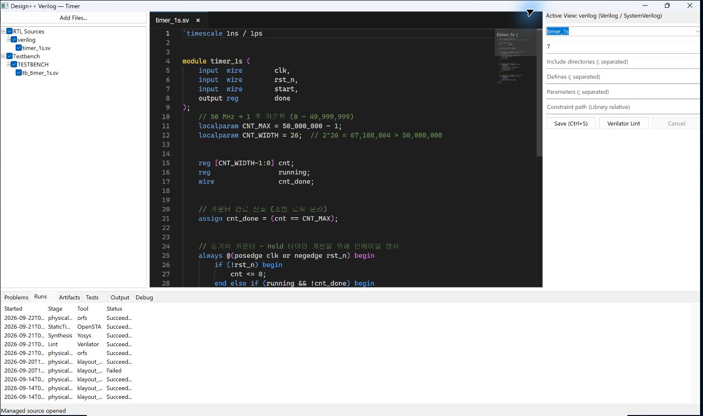

# 09. 실행 기록 · 로그 · 취소와 복구

[사용 설명서 목차](README.md) · [이전 단계](08-verification.md)

## 실행 결과 찾기

1. 작업 창의 **Runs**에서 시작 시각, 단계, 도구와 상태를 확인합니다.
   
2. 확인할 Run을 선택하고 보고서·artifact를 확인합니다.
3. 문제를 조사할 때는 요약 수치와 함께 원본 로그를 확인합니다.
4. Layout과 검증에서는 Source Run과 사용 환경도 함께 확인합니다.

Library Manager **Output**에는 여러 작업의 로그가 모입니다. 접두사의 작업 종류와
Cell 이름으로 구분합니다. 로그 끝에 보이는 메시지만으로 원인을 단정하지 말고
첫 오류와 종료 상태를 함께 봅니다.

## 취소와 재실행

**Cancel**은 취소 요청입니다. 종료 상태가 확정된 후 다시 실행합니다.
취소된 Run에 일부 파일이 남을 수 있으나 정상 완료 결과로 취급하지 않습니다.
기존 성공 Run이 목록에 남는 것은 현재 작업이 성공했다는 뜻이 아닙니다.

앱 재시작 후 미완료 기록은 지원되는 복구 경로에서 Interrupted로 표시될 수 있습니다.
자동 재개를 가정하지 말고 입력과 환경 호환성을 확인한 뒤 새 실행 또는
지원되는 checkpoint 재개를 선택합니다.

## 저장 충돌

다른 창이나 프로세스가 쓰기 소유권을 가지고 있으면 read-only 또는 충돌 안내가
나올 수 있습니다. 작업 중인 변경을 저장·백업한 뒤 소유 창을 정상 종료하거나
읽기 전용으로 확인합니다. 충돌 파일을 강제로 삭제하거나 두 편집기에서 덮어쓰지 않습니다.

## 문제를 보고할 때

다음 정보를 함께 남기면 재현에 도움이 됩니다.

- 앱 버전과 실행 단계, 선택한 backend/PDK
- Tool Check 결과, 선택한 WSL 배포판과 환경
- 실패 시각 및 Run ID, Failure stage/Reason/종료 코드
- 처음 오류가 발생한 구간을 포함하는 로그와 원본 보고서
- 마지막 성공 후 바꾼 소스·제약·설정

공유 전에 로그와 경로에 개인 정보나 비공개 설계 정보가 포함됐는지 확인합니다.
백업은 Library와 프로젝트 입력 및 필요한 Run 결과를 함께 보존하는 방식으로 수행합니다.

[사용 설명서 목차](README.md) · [이전 단계](08-verification.md)
